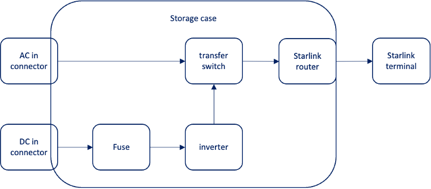

# StarRunner
## Overview
StarRunner is a fully self-contained SpaceX [Starlink](https://www.starlink.com) solution specifically designed for use with 
[Storyteller Overland](https://storytelleroverland.com) Mode vans. StarRunner mounts directly to a [Front Runner](https://www.frontrunneroutfitters.com/en/us/)
roof rack and can operate on 12VDC or 100 – 240VAC. When installed on a Storyteller van it can run directly from the available 12 “aux 1” supply available 
on the roof such that StarRunner can be installed and run without making any penetration to the van. When the van is parked in a location where Starlink 
is obstructed, the StarRunner can be removed and operated from the 120VAC source available on the side of the van using nothing more than a standard 
extension cord.

**StarRunner is portable, deployable, power friendly** 

## How it works
The Starlink home terminal is repackaged into a [Star-Mount Systems](https://star-mountsystems.com) Flat Mount enclosure.  The Flat Mount enclosure is 
then mounted onto a Front Runner Wolf Pack Pro storage box that contains the Starlink router, an inverter, an transfer switch, and supporting wiring. 
The approach uses generally available parts to enable others to build or remix the StarRunner design. The complete(ish) 
[BOM can be found here](/StarlinkFrontRunnerBOM.pdf)

 

Yes, the inverter and the power supply will generate heat. Yes, the black case will absorb the sun. No, I did not model any of this. Let’s just fire this thing up and see how it goes.

Yes, sticking the router / wifi inside the box with the Starlink on top and the top of the van below does will obstruct the signal. Additionally piling all the cabling on top makes it even worse. The signal is more than sufficient to provide excellent signal in the van.

Why not utilize some of the DC power solutions available:

## FAQ

**What are the downsides of using the Star-Mounts Flat panel “hack”?**

The Star-Mounts Flat Mount is a hack and will absolutely have an impact on performance. At this point there are thousands of Starlinks mounted in this 
way and generally the reported performance has been good. Make no mistake, this approach will cause issues such as inability to properly melt snow, 
inability for water to flow off during rain, reduced phased array scan, etc. It’s a hack, but the trades seem reasonable.

**Why not just use the Flat High Performance Starlink**

The Flat High-Performance (FLP) Starlink is a great product and ideal for enabling on-the-move / in-motion service with permanent installations. The 
FLP Starlink provides better performance ensuring proper operation without dropping the signal. FLP does this with a larger, heavier antenna panel 
which uses almost twice as much power of the home Starlink. 

**Why is this called StarRunner?**

StarRunner is just a play on Starlink and Front Runner.

**Why is the entire Starlink cable used?**

The Starlink router/power supply uses a SpaceX proprietary connector. The Star-Mounts Systems Flat Mount re-uses the proprietary connector as well. The cable could be cut and the length be reduced but that would also introduce another connector that could fail with little to no benefit.
